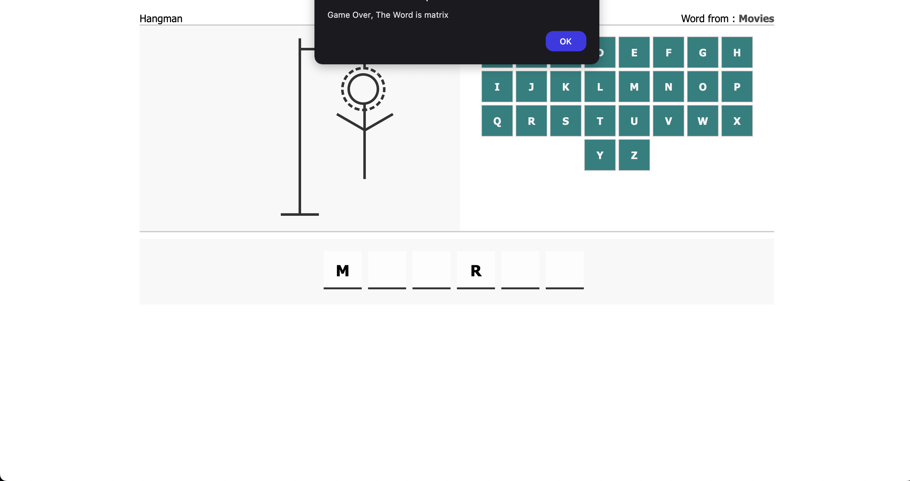

# Hangman Game

This project is a simple implementation of the hangman game using HTML, CSS and JavaScript.
It was built as a university project by the following contributors:

- [Eya Beldi](https://github.com/beldi5)
- [Iheb Meftah](https://github.com/ihebmeftah)

# source

[Source helped us](https://www.youtube.com/watch?v=ZFb_eaYtWwY) on YouTube.

